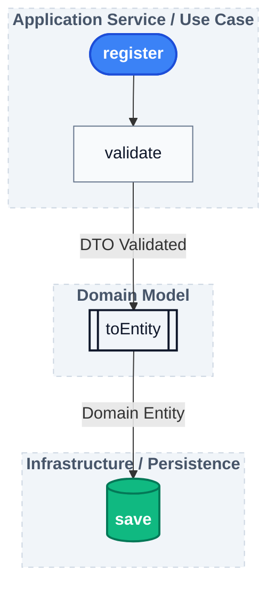
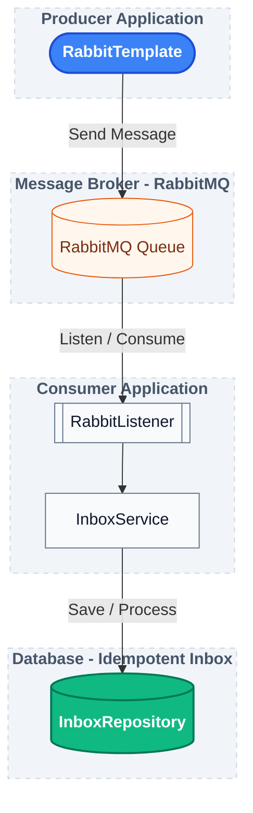

## Phase 03 — Registering Received Events

### Objective

The goal of this phase is to persist every received event before introducing idempotency.

At this point, the application still does **not** decide whether an event should be processed. Its only responsibility is to register that the event was successfully received.

This creates the foundation required for the Inbox Pattern.

---

## InboxEvent

An `InboxEvent` entity was introduced to represent every event received by the consumer.

Unlike the Outbox Pattern, the Inbox does not manage publication attempts or retries.

Its responsibility is much simpler:

* Store the event identifier.
* Store the event metadata.
* Store the original payload.
* Record when the event was received.

```text
EventEnvelope
        │
        ▼
InboxEvent
```

The persisted entity is almost a direct representation of the incoming `EventEnvelope`.

---

## InboxEventMapper

A dedicated mapper converts the messaging contract into the persistence model.

```text
EventEnvelope
        │
        ▼
InboxEventMapper
        │
        ▼
InboxEvent
```

Keeping this transformation isolated provides several advantages:

* separates messaging concerns from persistence;
* keeps the consumer simple;
* centralizes mapping logic in a single component;
* makes the transformation independently testable.

---

## InboxService

The `InboxService` introduces the first application use case.



Although the current implementation only performs structural validation, the service was intentionally designed to evolve.

Future phases will extend the validation step to include duplicate detection before persisting the event.

---

## Validation

The first validation layer verifies the integrity of the incoming event.

Current checks include:

* Event envelope
* Event metadata
* Event payload

At this stage, no duplicate verification is performed.

That responsibility belongs to the next phase.

---

## Testing Strategy

Two complementary testing approaches are now in place.

### Unit Test

`InboxEventMapperTest`

Validates the mapping between `EventEnvelope` and `InboxEvent`.

The test verifies every mapped field individually, ensuring the mapper correctly transfers all event information while leaving infrastructure-managed fields (such as `receivedAt`) untouched.

---

### Integration Test

`RabbitConsumerIntegrationTest`

The integration test validates the complete processing pipeline.



Instead of verifying only that the consumer method was invoked, the test now validates the observable result: the received event is successfully persisted in the Inbox.

---

## Architectural Note

This phase intentionally stops after persisting the received event.

The application **does not yet** answer the question:

> "Has this event already been processed?"

Instead, it prepares the necessary data to answer that question in the next phase.

This incremental approach keeps each phase focused on a single responsibility and mirrors the natural evolution of the Inbox Pattern implementation.
