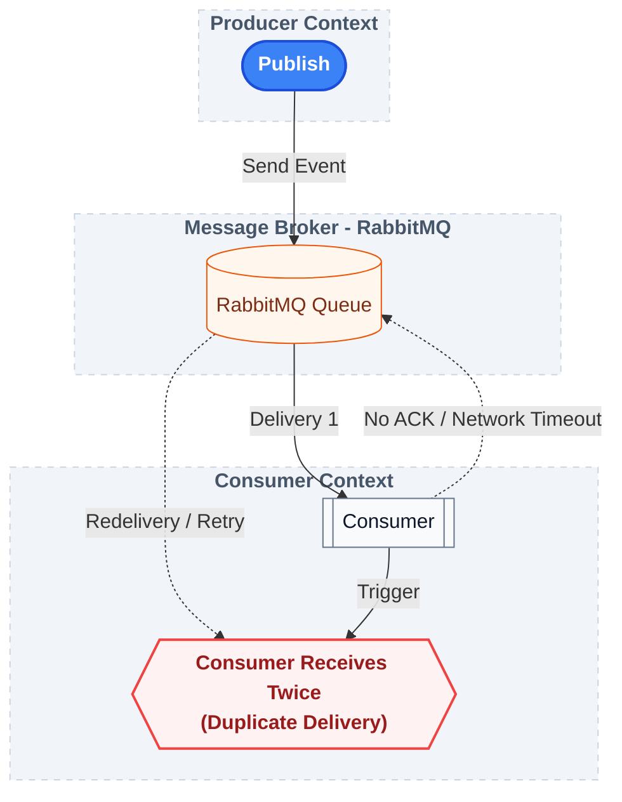

## Phase 04 — Idempotent Consumer

### Objective

The goal of this phase is to make the consumer **idempotent**.

Receiving the same event multiple times must not produce multiple processing attempts.

Instead of assuming that messages are delivered exactly once, the consumer now verifies whether the event has already been registered before persisting it.

---

## Why Idempotency Matters

Message brokers commonly provide **at-least-once delivery**.

This means the same event may be delivered multiple times due to situations such as:

* consumer failures before acknowledging the message;
* broker retries;
* network interruptions;
* connection failures.

Because duplicate delivery is expected, consumers must be designed to safely handle repeated events.

---

## Duplicate Detection

The Inbox Pattern uses the event identifier (`eventId`) as the deduplication key.

Before registering an event, the application checks whether that identifier already exists in the Inbox.

```text
Receive Event
      │
      ▼
Validate Structure
      │
      ▼
Already Registered?
      │
 ┌────┴────┐
 │         │
 No       Yes
 │         │
 ▼         ▼
Persist   Ignore
```

If the event has already been registered, the consumer simply returns without performing another persistence operation.

---

## InboxService

The registration flow now consists of four clearly defined steps.

```text
register()
    │
    ▼
validateStructure()
    │
    ▼
isAlreadyRegistered()
    │
    ▼
toEntity()
    │
    ▼
save()
```

Each step has a single responsibility.

* **validateStructure()** verifies that the received contract is valid.
* **isAlreadyRegistered()** checks the current application state.
* **toEntity()** converts the messaging contract into a persistence model.
* **save()** registers the event for future processing.

This separation keeps the application logic simple while making future extensions easier.

---

## Duplicate Events Are Not Errors

A duplicated event is **not** considered an exceptional situation.

It is an expected consequence of at-least-once message delivery.

For this reason, duplicated events are ignored instead of causing failures or retries.

```text
Duplicated Event
        │
        ▼
Already Registered
        │
        ▼
Ignore
```

This behavior allows the consumer to remain deterministic regardless of how many times the broker delivers the same message.

---

## Testing Strategy

This phase introduces two complementary testing approaches.

### Unit Test

`InboxServiceTest`

The service is tested in isolation by mocking the repository.

The test verifies that an already registered event does **not** trigger another persistence operation.

```text
existsById() = true
        │
        ▼
register()
        │
        ▼
save() is never called
```

This validates the idempotency rule independently of RabbitMQ and the database.

---

### Integration Test

`RabbitConsumerIntegrationTest`

The same event is published twice using the same `eventId`.



The test verifies two independent behaviors:

* the consumer receives both deliveries;
* only one record is stored in the Inbox.

This demonstrates the essence of the Inbox Pattern:

> Duplicate delivery does not produce duplicate processing.

---

## Testing Asynchronous Processing

Because the consumer executes asynchronously, the integration tests use Awaitility to wait until the expected application state becomes observable.

Instead of immediately accessing the entity, the test first verifies that the record is present.

```text
Wait
    │
    ▼
Event becomes available
    │
    ▼
Validate persisted data
```

This approach produces more expressive tests by separating the synchronization step from the validation itself.

---

## Architectural Note

The Inbox Pattern does **not** prevent duplicate message delivery.

That responsibility belongs to the message broker.

Instead, the consumer guarantees that repeated deliveries produce only one observable effect inside the application.

By using the `eventId` as a unique identifier, the consumer becomes resilient to duplicate deliveries while maintaining a consistent application state.