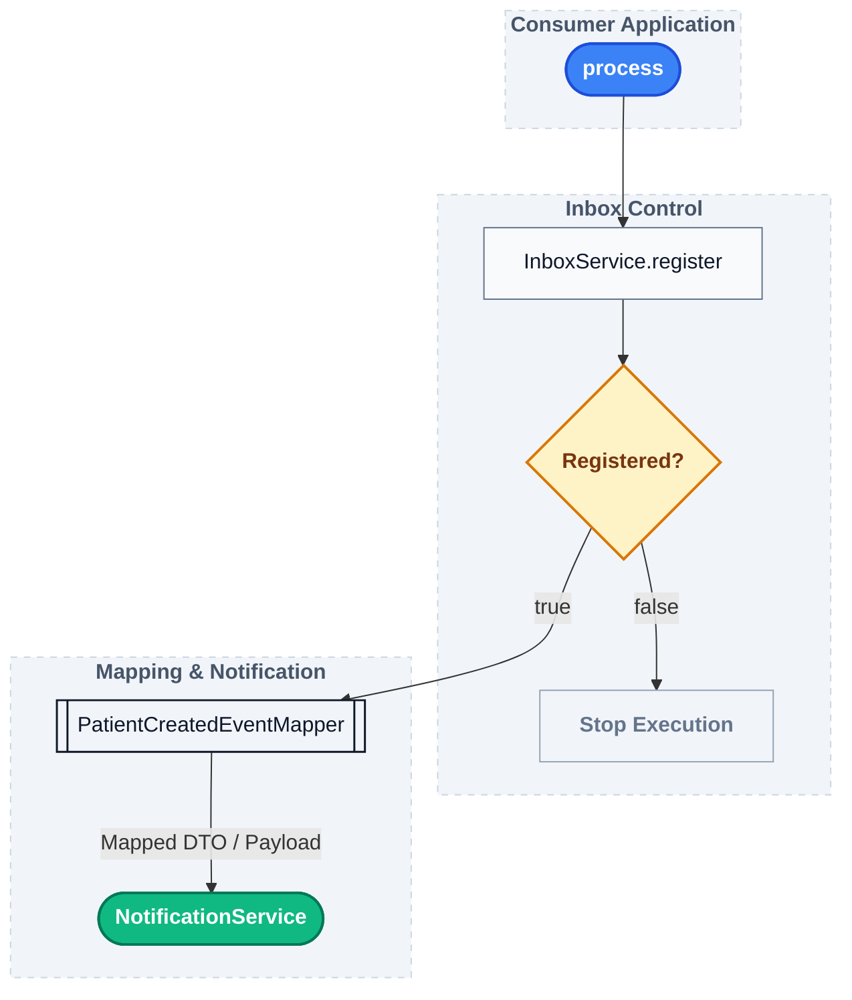
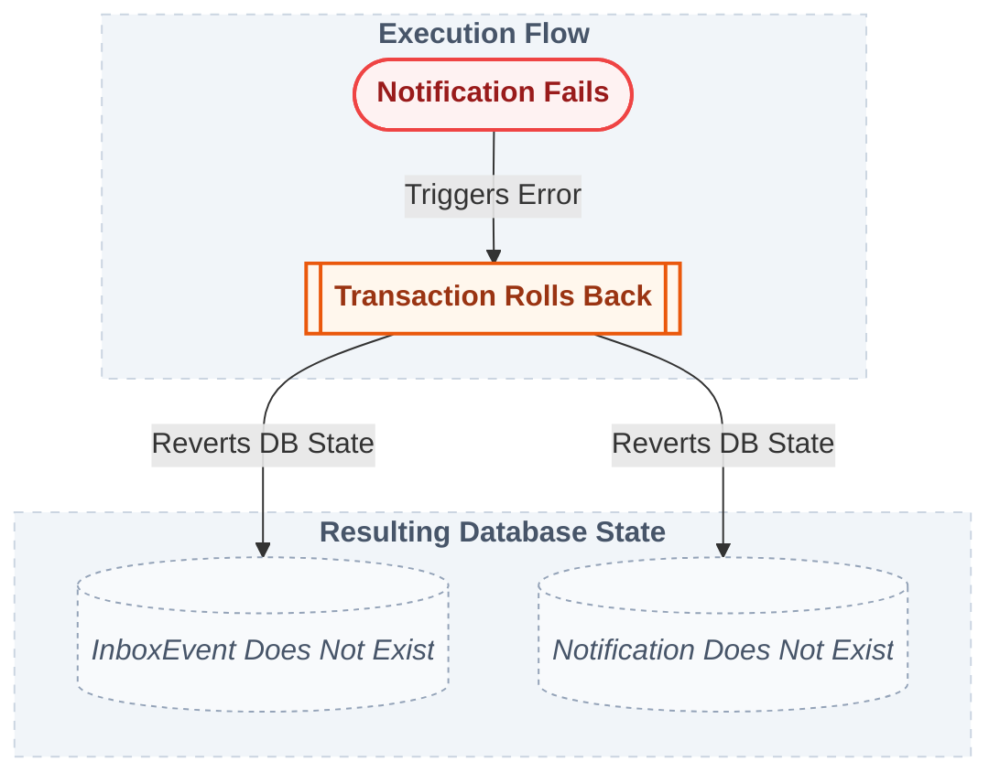
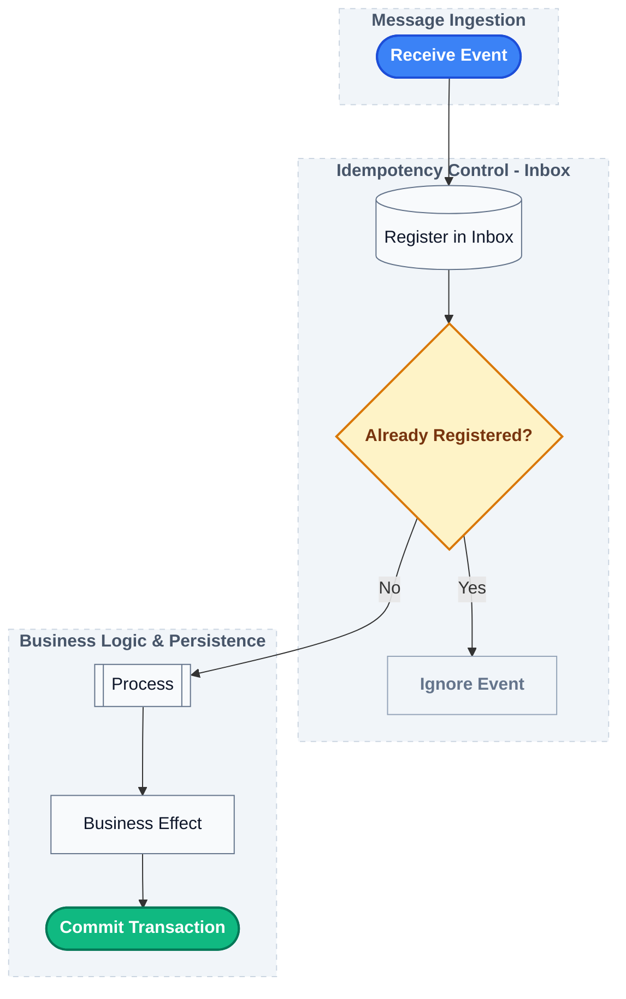

# Phase 05 — Business Processing

## Objective

The goal of this phase is to introduce **business processing** after an event has been registered in the Inbox.

Until the previous phase, the application was responsible only for receiving events and preventing duplicate registrations.

Now, a new `PatientCreatedEvent` continues through the processing flow and produces a business effect.

The main goal is to demonstrate that **Inbox registration and business processing are part of the same transaction**.

---

## Business Processing

The consumer was previously responsible for receiving the event and registering it through the `InboxService`.

The processing responsibility is now separated into `PatientCreatedProcessor`.

```text
RabbitMQ
    │
    ▼
PatientCreatedConsumer
    │
    ▼
PatientCreatedProcessor
    │
    ├── InboxService
    │
    └── NotificationService
```

The consumer remains intentionally simple and delegates the processing to the application service.

---

## PatientCreatedProcessor

The `PatientCreatedProcessor` coordinates the processing of a received event.

The flow is:



The `InboxService` returns a boolean indicating whether the event was newly registered.

* `true` means the event is new and processing should continue.
* `false` means the event was already registered and should be ignored.

This keeps duplicate detection inside the Inbox while allowing the Processor to decide whether business processing should continue.

---

## Notification

A simple `Notification` persistence model was introduced to represent the business effect of processing a `PatientCreatedEvent`.

The model contains:

* Notification identifier
* Patient identifier
* Patient name
* Creation timestamp

The notification is intentionally simple because the purpose of this phase is not to build a complete notification system.

It provides a persistent business effect that can participate in the same database transaction as the Inbox.

---

## NotificationService

A `NotificationService` abstraction was introduced:

```text
PatientCreatedEvent
        │
        ▼
NotificationService
        │
        ▼
NotificationDBService
        │
        ▼
NotificationRepository
```

The Processor depends on the service interface rather than directly on the persistence implementation.

The service receives the `PatientCreatedEvent` instead of the original `EventEnvelope`.

This keeps the business processing independent from the messaging transport.

---

## PatientCreatedEventMapper

A dedicated mapper converts the event payload into the business event:

```text
EventEnvelope
        │
        ▼
PatientCreatedEventMapper
        │
        ▼
PatientCreatedEvent
```

The existing `InboxEventMapper` remains responsible only for converting the incoming envelope into the Inbox persistence model.

This keeps the Inbox mapping independent from the specific business event being processed.

---

## Transaction

The `PatientCreatedProcessor` defines the transaction boundary.

The expected flow is:

```text
BEGIN
   │
   ├── Register InboxEvent
   │
   ├── Process PatientCreatedEvent
   │
   └── Create Notification
   │
COMMIT
```

If the business processing fails:

```text
BEGIN
   │
   ├── Register InboxEvent
   │
   ├── Create Notification
   │
   └── Failure
        │
        ▼
     ROLLBACK
```

This prevents the system from keeping an Inbox record for a processing attempt that did not complete successfully.

---

## Testing Strategy

### Unit Test

`PatientCreatedProcessorTest`

The Processor is tested in isolation.

The tests verify two main behaviors:

* a newly registered event is processed;
* an already registered event is ignored.

For a new event:

```text
InboxService.register() → true
        │
        ▼
NotificationService.create()
```

For a duplicated event:

```text
InboxService.register() → false
        │
        ▼
Stop processing
```

The `PatientCreatedEventMapper` is mocked because its behavior is tested separately.

---

### Integration Test

`RabbitConsumerIntegrationTest`

The existing integration tests were extended to validate the business processing flow.

A `PatientCreatedEvent` is published through RabbitMQ and the test verifies that:

* the event is registered in the Inbox;
* a Notification is created.

The test therefore validates the real flow from message delivery to database persistence.

```text
RabbitMQ
    │
    ▼
Consumer
    │
    ▼
Processor
    │
    ├── Inbox
    │
    └── Notification
```

---

### Transaction Integration Test

`PatientCreatedProcessorIntegrationTest`

A specific integration test verifies the transaction behavior when notification creation fails.

The `NotificationService` is configured as a spy and forced to throw a `RuntimeException`.

The expected result is:



This test demonstrates that Inbox registration and business processing are atomic.

---

## Architectural Note

The previous phase established the **Idempotent Consumer**.

This phase extends the pattern by adding business processing after successful registration.

The resulting flow is:



The important distinction is that the Inbox is not the business processing itself.

The Inbox records the received event and provides the information required for idempotency.

The Processor is responsible for coordinating the actual business processing.

The next phase will address what happens when business processing fails and how failed messages should be handled by the messaging infrastructure.
